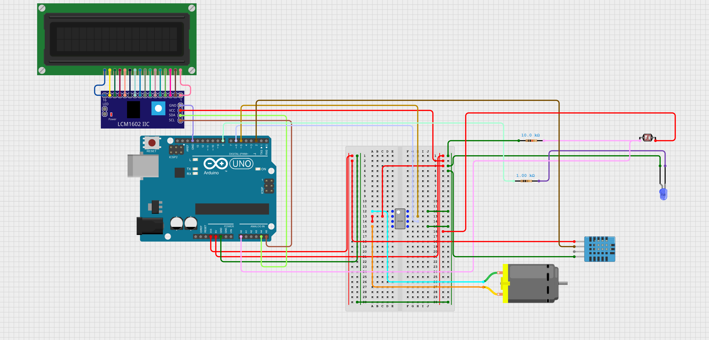

# UGA Hacks 8

##### Sidharth Chaudhary, Charles Lam, Noah Samples, Sarah Sileshi

<br>

<p align="center">
 
</p>

> The Plant-N-Go is an automatic sensor system that detects soil moisture, light level, air humidity and room temperature. This system can be activated when you leave your home and will water your plants as needed while you are away. It will also control room lighting as needed to maximize plant growth while minimizing energy consumption. The data is then sent to a website that can be viewed while traveling. This system uses an Arduino UNO, LCD, a humidity and temperature sensor, and a DC water pump.
<hr>

# Table of Contents
* [Hardware Required](#hr)
* [About the Hardware](#ah)
* [Hardware Setup](#hs)
* [Website Features](#wf)
* [Running the Web Server](#rws)
* [Media](#m)

# <a name="hr"></a>Hardware Required
* <a href="https://www.sparkfun.com/products/11021">Arduino UNO</a> x1
* <a href="https://www.digikey.com/en/products/detail/focus-display-solutions,-inc./C162A-BW-LW65/13901792?utm_adgroup=Focus%20Display%20Solutions%2C%20INC.&utm_source=google&utm_medium=cpc&utm_campaign=Shopping_DK%2BSupplier_Tier%201%20-%20Block%201&utm_term=&utm_content=Focus%20Display%20Solutions%2C%20INC.&gclid=Cj0KCQiAofieBhDXARIsAHTTldrfnxbEcoGekpcT930UTO1mDOkypcnqVV6L7zwSmPSZFhBcvRuWWNkaAtKLEALw_wcB">LCD 12c</a> x1
* <a href="https://www.digikey.com/en/products/detail/universal-solder-electronics-ltd/DHT11/16822119?utm_adgroup=UNIVERSAL-SOLDER%20ELECTRONICS%20LTD&utm_source=google&utm_medium=cpc&utm_campaign=Shopping_DK%2BSupplier_Tier%202%20-%20Block%203&utm_term=&utm_content=UNIVERSAL-SOLDER%20ELECTRONICS%20LTD&gclid=Cj0KCQiAofieBhDXARIsAHTTldpzbkvznooU4HisU8D9rFRqHQkVpB6gxFqMmvJdwaNrI4H6Xck2veUaAqHXEALw_wcB">Temperature and Humidity Sensor DHT11</a> x1
* <a href="https://www.adafruit.com/product/4546?gclid=Cj0KCQiAofieBhDXARIsAHTTldokD8E8BwFvs_Uxo9Fx2sLQJjyzHI3QTeLRO_ReIoLfin0n_AXS4I0aAiTyEALw_wcB">DC Water Pump</a> x1
* <a href="https://www.adafruit.com/product/4489">L9110H H-Bridge</a> x1
* <a href="https://lighthouseleds.com/5mm-led-uv-purple-ultra-bright-diffused.html?gclid=Cj0KCQiAofieBhDXARIsAHTTldpvHk5dJTu1UEUQUHL_Xm3WtVlXARv5mp0nI6y6_aaoatUsO-99igYaApXjEALw_wcB">UV LED</A> x1
* <a href="https://www.adafruit.com/product/161">Photoresistor</a> x1
* <a href="https://www.amazon.com/EDGELEC-Resistor-Tolerance-Multiple-Resistance/dp/B07QG1V4YL/ref=sr_1_1_sspa?keywords=1k+ohm+resistor&qid=1675578687&sr=8-1-spons&psc=1&spLa=ZW5jcnlwdGVkUXVhbGlmaWVyPUEzUkI2M1YwNENWMEI3JmVuY3J5cHRlZElkPUEwMDg3MDczMVZCRlZZQVVFVDFIQyZlbmNyeXB0ZWRBZElkPUEwNTQyMTU4MUJKMk1OMUhVR1o3MyZ3aWRnZXROYW1lPXNwX2F0ZiZhY3Rpb249Y2xpY2tSZWRpcmVjdCZkb05vdExvZ0NsaWNrPXRydWU=">1 kOhm Resistor</a> x1
* <a href="https://www.amazon.com/EDGELEC-Resistor-Tolerance-Multiple-Resistance/dp/B07QJB31M7/ref=sr_1_1_sspa?keywords=10k+ohm+resistor&qid=1675578717&sr=8-1-spons&psc=1&spLa=ZW5jcnlwdGVkUXVhbGlmaWVyPUEyTkZHQlZQVk9XM1UxJmVuY3J5cHRlZElkPUEwMTU0NDE0M0cwVDBWMzJOWDZCWSZlbmNyeXB0ZWRBZElkPUEwODA3NzIxMkFNVEJWRVdPMUFHTCZ3aWRnZXROYW1lPXNwX2F0ZiZhY3Rpb249Y2xpY2tSZWRpcmVjdCZkb05vdExvZ0NsaWNrPXRydWU=">10 kOhm Resistor</a> x1
* <a href="https://www.amazon.com/AmazonBasics-USB-2-0-Cable-Male/dp/B00NH11KIK/ref=asc_df_B00NH11KIK/?tag=hyprod-20&linkCode=df0&hvadid=167151358503&hvpos=&hvnetw=g&hvrand=12043408033904809208&hvpone=&hvptwo=&hvqmt=&hvdev=c&hvdvcmdl=&hvlocint=&hvlocphy=9011070&hvtargid=pla-181858139331&psc=1&region_id=972485">USB 2.0 Cable Type A/B</a> x1
* <a href="https://www.amazon.com/Elegoo-EL-CP-004-Multicolored-Breadboard-arduino/dp/B01EV70C78/ref=asc_df_B01EV70C78/?tag=hyprod-20&linkCode=df0&hvadid=222785939698&hvpos=&hvnetw=g&hvrand=655115302587060304&hvpone=&hvptwo=&hvqmt=&hvdev=c&hvdvcmdl=&hvlocint=&hvlocphy=9011070&hvtargid=pla-362913641420&psc=1&region_id=972485">Jumper wires</a>

# <a name="ah"></a>About the Hardware
The Arduino Uno is a microcontroller that allows users to write code In c++ on their computer and upload it to a physical board. The Liquid Crystal Display(LCD) is a flat-panel display or other electronically modulated optical devices that uses liquid crystals' light-modulating properties combined with polarizers. This allows users to display information on a screen without using a computer. The DHT11 Temperature and Humidity Sensor is a capacitive humidity sensor that measures humidity using a metal oxide strip between two electrodes. As humidity increases, this changes the metal oxide's electrical capacity. To detect temperature, the DHT11 uses a thermistor which is a temperature-dependent resistor. The thermistor resistance decreases as the temperature increases. At low temperatures, the resistance of a thermistor is high, and little current can flow through. At high temperatures, the resistance of a thermistor is low, and more current can flow through. The Photoresistor is a sensor that changes its resistance when light shines on it. A high light intensity will cause a lower resistance, whereas a lower light intensity will cause higher resistance. The L9110H H-Bridge is an integrated circuit which powers the pump motor and controls the direction it spins.

# <a name="hs"></a>Hardware Setup


# <a name="wf"></a>Website Features
The website provides live plant vital information such as soil moisture, light levels, and temperature. The website can also graph the current vitals by pressing the update button.
<br>


# <a name="rws"></a>Running the Web Server
To run the web server, the sensor system must be connected to communication port 3 using the USB 2.0 cable. In the terminal enter the following command from the Hackathon 2023 Project/js
```
node ./app.js
```
Then in a browser (preferably Google Chrome) open the following address:
```
localhost:300
```
# <a name="m"></a>Media
